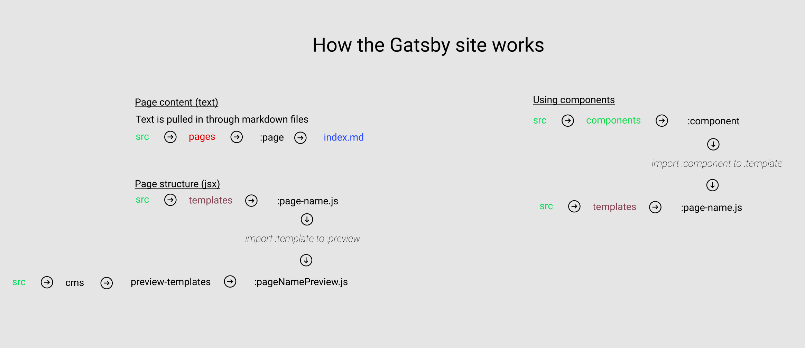

# Helpers

## 'site path'

### To aid navigation of site during development

---

## Admin

### Adding blog posts

Check dev server is running, if not run `gatsby develop` to start localhost server up

Go to `http://localhost:8000/admin/#/collections/blog`

Click `new blog`

Note that `http://localhost:8000/admin/#/collections/blog` seems to be the admin home page, there is nothing at `http://localhost:8000/admin/`

### Adding images

Same steps as **'Adding blog posts'**, then click `Media` at the top.

---

## Updating page content (text)

Using the CMS editor, in the contents tab of `admin` (in localhost), `collections => pages`, click a page and the CMS editor will appear.

**Note** that saving/publshing changes here go straight to live.
